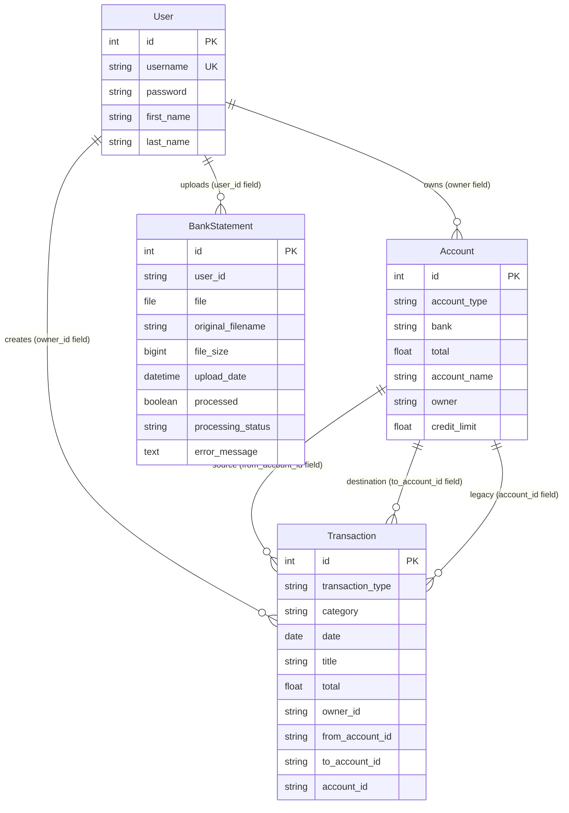

# Home Money Management - Budget Buddy

A comprehensive full-stack personal finance management application that helps users track expenses, manage multiple accounts, and visualize their financial data with smart projections.

## 🚀 Features

### 💰 Financial Management

- **Multi-Account Support**: Manage multiple bank accounts with different types (Savings, Checking, etc.)
- **Transaction Tracking**: Record and categorize income and expenses
- **Real-time Balance Updates**: Automatic balance calculations across all accounts
- **Date-based Filtering**: View transactions by month and year

### 📊 Data Visualization

- **Interactive Charts**: Beautiful pie charts showing expense categories
- **Financial Projections**: Smart forecasting based on historical data with seamless solid-to-dotted line transitions
- **Income vs Expense Analysis**: Visual comparison of financial flows
- **Account Carousel**: Modern card-based account overview

### 🎨 Modern User Interface

- **Responsive Design**: Works seamlessly on desktop, tablet, and mobile
- **Material Design**: Built with Vuetify 3 for a modern, professional look
- **Dark/Light Theme Support**: Customizable visual experience
- **Intuitive Navigation**: Clean, user-friendly interface

### 🔐 Security & Authentication

- **User Registration & Login**: Secure authentication system
- **Session Management**: Persistent login with localStorage
- **Data Privacy**: User-specific data isolation

## 🏗️ Architecture

### Backend (Django REST API)

- **Framework**: Django 4.2.5 with Django REST Framework 3.14.0
- **Database**: SQLite (easily configurable for PostgreSQL/MySQL)
- **API Endpoints**: RESTful APIs for users, accounts, and transactions
- **Admin Interface**: Django admin for data management

### Database Schema

The application uses a relational database structure with the following entities and relationships:



**Key Relationships:**

- **User → Account**: One-to-Many (User owns multiple accounts via `owner` field)
- **User → Transaction**: One-to-Many (User creates multiple transactions via `owner_id` field)
- **User → BankStatement**: One-to-Many (User uploads multiple bank statements via `user_id` field)
- **Account → Transaction**: One-to-Many (Account can be source/destination for multiple transactions)
- **Transaction Types**: Income, Expense, Transfer (with different account relationships)

**Database Design Notes:**

- **String-based Relationships**: The application uses string fields (`owner_id`, `from_account_id`, `to_account_id`, `account_id`) instead of formal foreign keys for flexibility
- **Transaction Flexibility**: Transactions support three types:
  - **Income/Expense**: Uses `account_id` for single account
  - **Transfer**: Uses `from_account_id` and `to_account_id` for inter-account transfers
- **Credit Card Support**: Accounts include `credit_limit` field for credit card management
- **File Management**: BankStatement model handles PDF uploads with processing status tracking
- **Data Isolation**: All user data is isolated by username/user_id fields for security

**Supported Account Types:**

- **Debit** (`Débito`): Checking/Savings accounts with positive balances
- **Credit** (`Crédito`): Credit card accounts with credit limits and available credit tracking
- **Cash** (`Efectivo`): Physical cash accounts
- **Investment** (`Inversión`): *Ready to support* - schema is flexible enough, just needs UI implementation

### Frontend (Vue.js 3)

- **Framework**: Vue.js 3 with TypeScript
- **UI Library**: Vuetify 3 with Material Design
- **Charts**: Chart.js with vue-chartjs for data visualization
- **Build Tool**: Vite for fast development and building

### Deployment

- **Containerization**: Docker and Docker Compose
- **Multi-container Setup**: Separate containers for API and UI
- **Development Ready**: Hot reload and development tools included

## 📁 Project Structure

```text
HomeMoneyManagement/
├── API/                          # Django Backend
│   ├── users/                    # User management app
│   │   ├── models.py            # User model
│   │   ├── views.py             # User API endpoints
│   │   ├── serializers.py       # User data serialization
│   │   ├── services.py          # User business logic
│   │   └── migrations/          # Database migrations
│   ├── account/                  # Account management app
│   │   ├── models.py            # Account model
│   │   ├── views.py             # Account API endpoints
│   │   ├── serializers.py       # Account data serialization
│   │   └── migrations/          # Database migrations
│   ├── transaction/              # Transaction management app
│   │   ├── models.py            # Transaction model
│   │   ├── views.py             # Transaction API endpoints
│   │   ├── serializers.py       # Transaction data serialization
│   │   └── migrations/          # Database migrations
│   ├── bankstatements/           # Bank statement processing app
│   │   ├── models.py            # BankStatement model
│   │   ├── views.py             # Statement upload/processing endpoints
│   │   ├── serializers.py       # Statement data serialization
│   │   └── migrations/          # Database migrations
│   ├── MoneyManagement/          # Django project settings
│   │   ├── settings.py          # Main configuration
│   │   ├── urls.py              # URL routing
│   │   ├── wsgi.py              # WSGI configuration
│   │   └── error_handlers.py    # Custom error handling
│   ├── requirements.txt          # Python dependencies
│   ├── Dockerfile               # Backend container config
│   ├── create_superuser.py      # Admin user creation script
│   ├── create_superuser_interactive.py  # Interactive admin creation
│   ├── create_test_user.py      # Test user creation script
│   ├── db.sqlite3               # SQLite database (development)
│   ├── README.md                # API documentation
│   ├── DEVELOPMENT.md           # Development history and issues
│   └── TEST_DATA_README.md      # Test data documentation
├── UI/                          # Vue.js Frontend
│   └── home-money-management/
│       ├── src/
│       │   ├── components/      # Vue components
│       │   │   ├── LoginRegister.vue
│       │   │   ├── MainPage.vue
│       │   │   ├── AccountsCarousel.vue
│       │   │   ├── DatePicker.vue
│       │   │   ├── IncomeExpense.vue
│       │   │   ├── PieChart.vue
│       │   │   ├── Projections.vue
│       │   │   ├── TableData.vue
│       │   │   ├── BankStatementUpload.vue
│       │   │   └── BankStatementReview.vue
│       │   ├── views/           # Page views
│       │   │   ├── Home.vue
│       │   │   └── Profile.vue
│       │   ├── layouts/         # Layout components
│       │   │   └── default/
│       │   │       ├── AppBar.vue
│       │   │       ├── Default.vue
│       │   │       └── View.vue
│       │   ├── router/          # Vue Router configuration
│       │   │   └── index.ts
│       │   ├── plugins/         # Vuetify and other plugins
│       │   │   ├── index.ts
│       │   │   └── vuetify.ts
│       │   ├── types/           # TypeScript type definitions
│       │   │   └── global.d.ts
│       │   ├── styles/          # SCSS styles
│       │   │   └── settings.scss
│       │   ├── assets/          # Static assets
│       │   │   ├── logo.png
│       │   │   └── logo.svg
│       │   ├── App.vue          # Main app component
│       │   ├── main.ts          # Application entry point
│       │   └── shims-vue.d.ts   # Vue type declarations
│       ├── public/              # Public assets
│       │   ├── favicon.ico
│       │   └── favicon.png
│       ├── dist/                # Built application (production)
│       ├── package.json         # Node.js dependencies
│       ├── package-lock.json    # Dependency lock file
│       ├── tsconfig.json        # TypeScript configuration
│       ├── vite.config.ts       # Vite build configuration
│       ├── Dockerfile          # Frontend container config
│       └── README.md           # Frontend documentation
├── Utils/                       # Utility scripts and tools
│   ├── README.md               # Utils documentation
│   └── TestData/               # Test data generation scripts
│       ├── populate_test_data.py
│       ├── populate_quick_test_data.py
│       ├── create_docker_test_data.py
│       ├── populate_test_data.bat
│       └── populate_test_data.sh
├── docker-compose.yaml          # Multi-container orchestration
├── create_admin_user.sh         # Admin user creation script
├── security-check.sh            # Security validation script
├── ADMIN_SETUP.md              # Django admin setup guide
├── SECURITY.md                 # Security policies and fixes
├── POSTGRES_MIGRATION.md       # PostgreSQL migration guide
└── README.md                   # This file
```

## 🚀 Quick Start

### Prerequisites

- Docker and Docker Compose
- Git

### Installation & Setup

1. **Clone the repository**

   ```bash
   git clone <repository-url>
   cd HomeMoneyManagement
   ```

2. **Start the application**

   ```bash
   docker-compose up --build
   ```

3. **Access the application**
   - **Frontend**: <http://localhost:8080>
   - **Backend API**: <http://localhost:8000>
   - **Admin Interface**: <http://localhost:8000/admin>

### Default Admin Credentials

- **Username**: `admin`
- **Email**: `admin@example.com`
- **Password**: `admin123`

### Test Data Setup

For testing with realistic data, you can populate the database with sample data:

```bash
# Quick setup (2 accounts, 20 transactions)
cd Utils/TestData
python populate_quick_test_data.py

# Full setup (4 accounts, 100 transactions)
python populate_test_data.py

# Interactive menu (Windows)
populate_test_data.bat

# Interactive menu (Unix/Linux)
chmod +x populate_test_data.sh
./populate_test_data.sh
```

**Test User Credentials**:

- **Username**: `testUser`
- **Password**: `testpass123`

## 🎯 Usage Guide

### Getting Started

1. **Register/Login**: Create a new account or login with existing credentials
2. **Add Accounts**: Create your first bank account with initial balance
3. **Record Transactions**: Start adding income and expense transactions
4. **View Analytics**: Explore your financial data through charts and projections

### Key Features

#### Account Management

- Create multiple accounts (Savings, Checking, Credit, etc.)
- Set initial balances and account details
- View account summaries in an interactive carousel

#### Transaction Tracking

- Add income and expense transactions
- Categorize transactions for better organization
- Filter transactions by date, account, and type
- Edit and delete existing transactions

#### Financial Analytics

- **Pie Charts**: Visual breakdown of expense categories
- **Income vs Expense**: Monthly comparison charts
- **Financial Projections**: Future financial forecasting based on historical trends
- **Account Balances**: Real-time balance tracking across all accounts

#### Projections Feature

- **Smart Forecasting**: Predicts future financial trends
- **Configurable Periods**: 3 months, 6 months, or 1 year projections
- **Account Filtering**: View projections for specific accounts or all accounts
- **Visual Distinction**: Solid lines for historical data, dotted lines for projections
- **Seamless Transitions**: Continuous lines that transition from solid to dotted at the appropriate point

## 🔧 Development

### Backend Development

```bash
# Navigate to API directory
cd API

# Install dependencies
pip install -r requirements.txt

# Run migrations
python manage.py makemigrations
python manage.py migrate

# Create superuser
python create_superuser.py

# Start development server
python manage.py runserver
```

### Frontend Development

```bash
# Navigate to UI directory
cd UI/home-money-management

# Install dependencies
npm install

# Start development server
npm run dev

# Build for production
npm run build
```

### API Endpoints

#### Users

- `POST /user/` - Create new user
- `POST /user/<username>/` - User login
- `DELETE /user/<username>/` - Delete user

#### Accounts

- `POST /accounts/` - Create new account
- `GET /accounts/details/<username>/` - Get user accounts
- `PATCH /accounts/details/<username>/` - Update account balance
- `DELETE /accounts/delete/<username>/<id>/` - Delete account

#### Transactions

- `POST /transactions/create/` - Create new transaction
- `GET /transactions/retrieve/<username>/<account_id>/<month>/<year>/` - Get transactions
- `PATCH /transactions/update/<transaction_id>/` - Update transaction
- `DELETE /transactions/delete/<transaction_id>/` - Delete transaction

## 🐳 Docker Deployment

### Production Deployment

```bash
# Build and start containers
docker-compose up --build -d

# View logs
docker-compose logs -f

# Stop containers
docker-compose down
```

### Environment Configuration

- Backend runs on port 8000
- Frontend runs on port 8080
- Database: SQLite (configurable)
- Admin interface available at `/admin`

## 📊 Technology Stack

### Backend

- **Django 4.2.5**: Web framework
- **Django REST Framework 3.14.0**: API framework
- **SQLite**: Database (production-ready alternatives available)
- **Python 3.x**: Runtime environment

### Frontend

- **Vue.js 3**: Progressive JavaScript framework
- **TypeScript**: Type-safe JavaScript
- **Vuetify 3**: Material Design component framework
- **Chart.js**: Data visualization library
- **Vite**: Build tool and development server
- **Vue Router**: Client-side routing

### DevOps

- **Docker**: Containerization
- **Docker Compose**: Multi-container orchestration
- **Nginx**: Web server (production frontend)

## 🔒 Security Features

- **User Authentication**: Secure login system
- **Data Isolation**: User-specific data access
- **Input Validation**: Server-side validation for all inputs
- **SQL Injection Protection**: Django ORM protection
- **XSS Protection**: Built-in Django security features

## 📈 Performance Features

- **Responsive Design**: Optimized for all screen sizes
- **Lazy Loading**: Efficient component loading
- **Chart Optimization**: Smooth animations and interactions
- **Database Indexing**: Optimized queries
- **Container Optimization**: Efficient Docker images

## 🤝 Contributing

1. Fork the repository
2. Create a feature branch (`git checkout -b feature/amazing-feature`)
3. Commit your changes (`git commit -m 'Add some amazing feature'`)
4. Push to the branch (`git push origin feature/amazing-feature`)
5. Open a Pull Request

## 📝 License

This project is licensed under the MIT License - see the LICENSE file for details.

## 📚 Documentation

### Core Documentation

- **[API/README.md](API/README.md)** - Complete API documentation with endpoints and examples
- **[ADMIN_SETUP.md](ADMIN_SETUP.md)** - Django admin interface setup and usage guide
- **[SECURITY.md](SECURITY.md)** - Security policies, vulnerability management, and recent security fixes
- **[API/DEVELOPMENT.md](API/DEVELOPMENT.md)** - Development history, issue resolution, and implementation details
- **[API/TEST_DATA_README.md](API/TEST_DATA_README.md)** - Test data generation scripts and usage guide

### Quick Reference

- **API Endpoints**: See [API/README.md](API/README.md) for complete endpoint documentation
- **Admin Access**: See [ADMIN_SETUP.md](ADMIN_SETUP.md) for admin interface setup
- **Security Updates**: See [SECURITY.md](SECURITY.md) for latest security fixes and policies
- **Development Issues**: See [API/DEVELOPMENT.md](API/DEVELOPMENT.md) for resolved issues and fixes
- **Test Data Setup**: See [Utils/README.md](Utils/README.md) for test data generation scripts

## 🔒 Security

For security-related information:

- Review [SECURITY.md](SECURITY.md) for security policies and vulnerability management
- Check the [ADMIN_SETUP.md](ADMIN_SETUP.md) for admin interface setup
- Report security issues responsibly through GitHub security advisories

## 🆘 Support

For support and questions:

- Check the [ADMIN_SETUP.md](ADMIN_SETUP.md) for admin interface setup
- Review the API documentation in [API/README.md](API/README.md)
- Check [API/DEVELOPMENT.md](API/DEVELOPMENT.md) for common issues and solutions
- Open an issue on GitHub

## 🎉 Acknowledgments

- Built with Vue.js and Django
- UI components by Vuetify
- Charts powered by Chart.js
- Icons by Material Design Icons

---

**Budget Buddy** - Your smart companion for financial management! 💰📊
