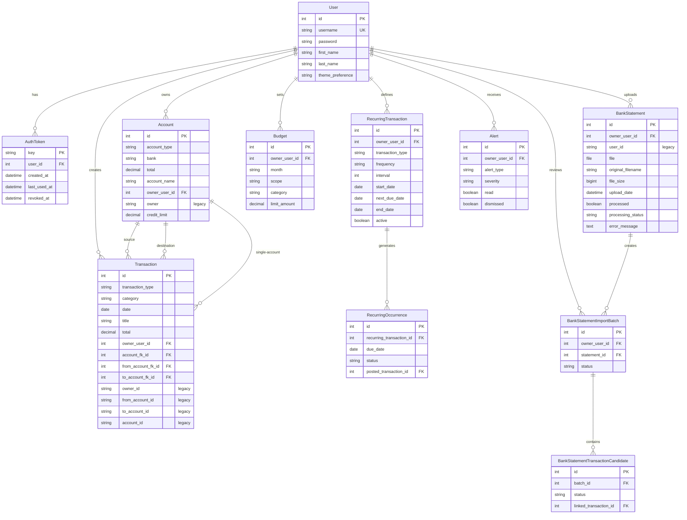
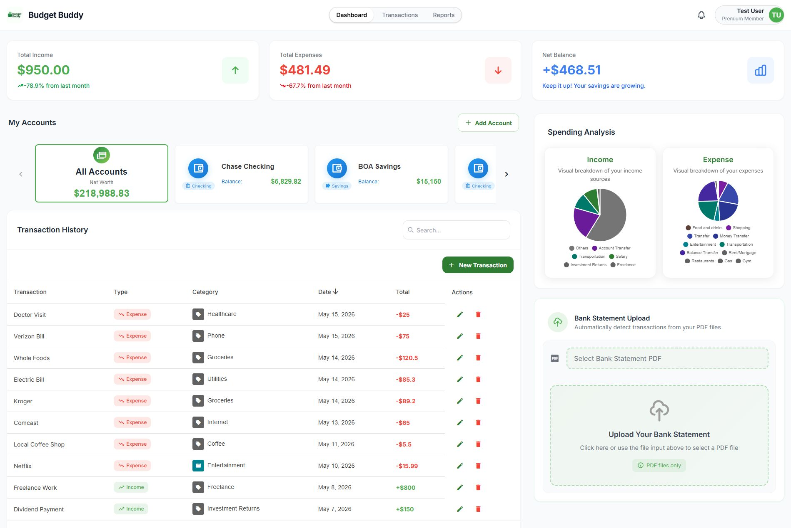
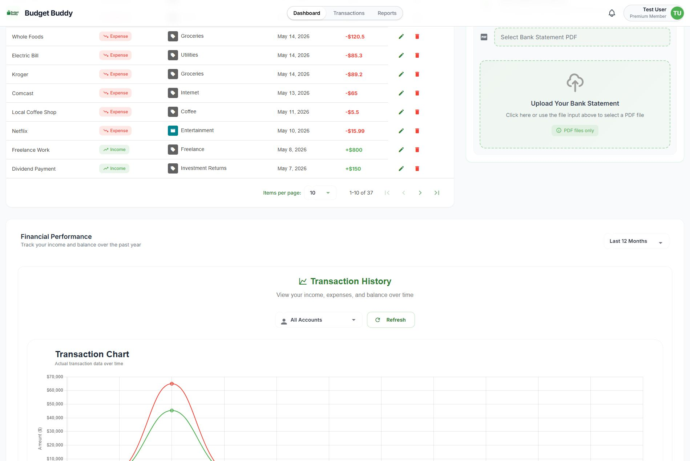
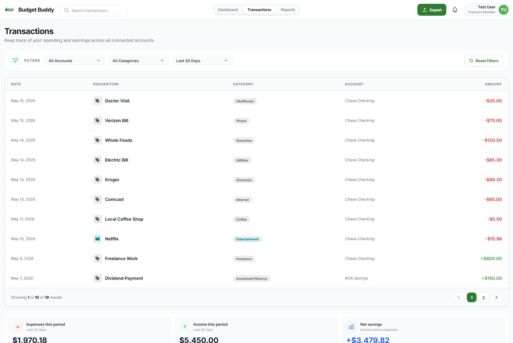
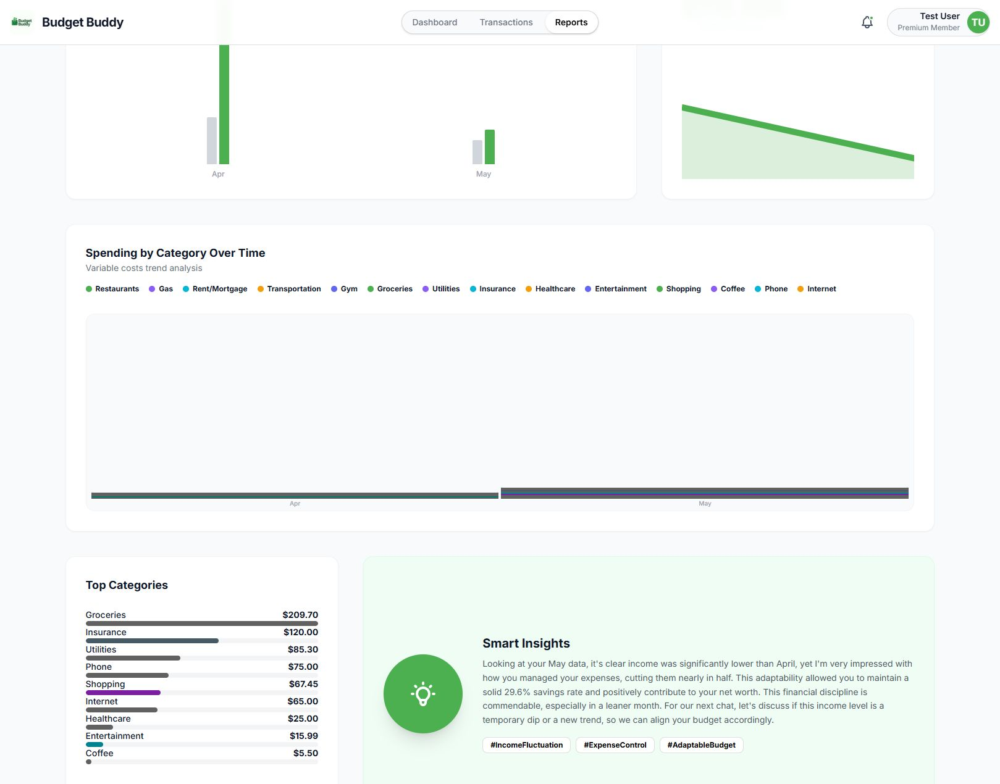

# Home Money Management - Budget Buddy

A comprehensive full-stack personal finance management application that helps users track expenses, manage multiple accounts, plan budgets, confirm recurring items, reconcile statement imports, and visualize financial data with forecasting and in-app alerts.

## 🚀 Features

### 💰 Financial Management

- **Multi-Account Support**: Manage multiple bank accounts with different types (Savings, Checking, Credit Cards, Cash, etc.)
- **Credit Card Management**: Track credit limits, available credit, and used credit with real-time calculations
- **Net Worth Calculation**: Automatic calculation of total net worth (assets minus liabilities)
- **Transaction Tracking**: Record and categorize income and expenses
- **First-Class Transfers**: Move money between accounts with required source/destination accounts; transfers are excluded from income/expense totals
- **Monthly Budgets**: Track overall monthly budgets and category-specific budgets with spent, remaining, percent-used, and status calculations
- **Recurring Transactions**: Define income, expense, and transfer rules that generate due items for user confirmation before posting real transactions
- **Real-time Balance Updates**: Automatic balance calculations across all accounts
- **Date-based Filtering**: View transactions by month and year
- **AI-Powered Bank Statement Processing**: Upload PDF bank statements (including password-protected files) for automatic transaction extraction using Google AI Studio (Gemini API)
- **Initial Balance Detection**: Automatically detects and sets initial account balances from bank statements
- **Import Reconciliation**: Review parsed statement candidates, detect possible duplicates, import, skip, or link to existing transactions with idempotent commits

### 📊 Data Visualization

- **Interactive Charts**: Beautiful pie charts showing expense categories
- **Cashflow Forecasting**: Forecast future balances from current balances, confirmed transactions, recurring items, budgets, and trailing history
- **Financial Projections**: Smart forecasting based on historical data with seamless solid-to-dotted line transitions
- **Income vs Expense Analysis**: Visual comparison of financial flows
- **In-App Alerts**: Alert center for budget thresholds, recurring due/overdue items, forecasted negative balances, and import duplicate-review items
- **Account Carousel**: Modern card-based account overview

### 🎨 Modern User Interface

- **Responsive Design**: Works seamlessly on desktop, tablet, and mobile
- **Material Design**: Built with Vuetify 3 for a modern, professional look
- **Dark/Light Theme Support**: Persisted user preference for `system`, `light`, or `dark`, with a quick header toggle
- **Intuitive Navigation**: Clean, user-friendly interface

### 🔐 Security & Authentication

- **User Registration & Login**: Secure authentication system
- **Token Authentication**: DRF-style opaque tokens sent with `Authorization: Token <token>`
- **Session Management**: The frontend stores only `{ token, user }` in localStorage and clears invalid/legacy sessions
- **Data Privacy**: Server-enforced user-specific data isolation

## 🏗️ Architecture

### Backend (Django REST API)

- **Framework**: Django 4.2.30 with Django REST Framework 3.15.2
- **Database**: PostgreSQL in Docker, SQLite for lightweight local development
- **API Endpoints**: RESTful APIs for users, accounts, transactions, budgets, recurring transactions, bank statements, reports, and alerts
- **Admin Interface**: Django admin for data management

### Database Schema

The application uses formal ownership/account foreign keys for integrity while temporarily keeping legacy string fields populated for older API/UI compatibility:


```mermaid
erDiagram
    User {
        int id PK
        string username UK
        string password
        string first_name
        string last_name
        string theme_preference
    }
    
    AuthToken {
        string key PK
        int user_id FK
        datetime created_at
        datetime last_used_at
        datetime revoked_at
    }

    Account {
        int id PK
        string account_type
        string bank
        decimal total
        string account_name
        int owner_user_id FK
        string owner "legacy"
        decimal credit_limit
    }
    
    Transaction {
        int id PK
        string transaction_type
        string category
        date date
        string title
        decimal total
        int owner_user_id FK
        int account_fk_id FK
        int from_account_fk_id FK
        int to_account_fk_id FK
        string owner_id "legacy"
        string from_account_id "legacy"
        string to_account_id "legacy"
        string account_id "legacy"
    }
    
    BankStatement {
        int id PK
        int owner_user_id FK
        string user_id "legacy"
        file file
        string original_filename
        bigint file_size
        datetime upload_date
        boolean processed
        string processing_status
        text error_message
    }

    Budget {
        int id PK
        int owner_user_id FK
        string month
        string scope
        string category
        decimal limit_amount
    }

    RecurringTransaction {
        int id PK
        int owner_user_id FK
        string transaction_type
        string frequency
        int interval
        date start_date
        date next_due_date
        date end_date
        boolean active
    }

    RecurringOccurrence {
        int id PK
        int recurring_transaction_id FK
        date due_date
        string status
        int posted_transaction_id FK
    }

    BankStatementImportBatch {
        int id PK
        int owner_user_id FK
        int statement_id FK
        string status
    }

    BankStatementTransactionCandidate {
        int id PK
        int batch_id FK
        string status
        int linked_transaction_id FK
    }

    Alert {
        int id PK
        int owner_user_id FK
        string alert_type
        string severity
        boolean read
        boolean dismissed
    }
    
    User ||--o{ AuthToken : "has"
    User ||--o{ Account : "owns"
    User ||--o{ Transaction : "creates"
    User ||--o{ BankStatement : "uploads"
    User ||--o{ Budget : "sets"
    User ||--o{ RecurringTransaction : "defines"
    User ||--o{ BankStatementImportBatch : "reviews"
    User ||--o{ Alert : "receives"
    Account ||--o{ Transaction : "source"
    Account ||--o{ Transaction : "destination"
    Account ||--o{ Transaction : "single-account"
    RecurringTransaction ||--o{ RecurringOccurrence : "generates"
    BankStatement ||--o{ BankStatementImportBatch : "creates"
    BankStatementImportBatch ||--o{ BankStatementTransactionCandidate : "contains"
```

**Key Relationships:**

- **User → Account**: One-to-Many through `Account.owner_user`
- **User → Transaction**: One-to-Many through `Transaction.owner_user`
- **User → BankStatement**: One-to-Many through `BankStatement.owner_user`
- **User → Budget**: One-to-Many monthly budgets through `Budget.owner_user`
- **User → RecurringTransaction**: One-to-Many rules through `RecurringTransaction.owner_user`
- **User → Alert**: One-to-Many in-app alerts through `Alert.owner_user`
- **Account → Transaction**: One-to-Many through `account_fk`, `from_account_fk`, and `to_account_fk`
- **Transaction Types**: Income, Expense, Transfer (with different account relationships)

**Database Design Notes:**

- **Foreign-key Integrity**: Ownership and account references are enforced by database relationships and owner-scoped validation
- **Compatibility Fields**: Legacy strings (`owner`, `owner_id`, `from_account_id`, `to_account_id`, `account_id`, `user_id`) remain populated during this transition
- **Decimal Money**: Balances, credit limits, and transaction totals use fixed-precision decimal fields
- **Token Auth**: `users.AuthToken` provides opaque API tokens and supports logout/revocation
- **User Preferences**: `theme_preference` stores `system`, `light`, or `dark`
- **Transaction Flexibility**: Transactions support three types:
  - **Income/Expense**: Uses `account_id` for single account
  - **Transfer**: Uses `from_account_id` and `to_account_id` for inter-account transfers
- **Budgeting**: Monthly `overall` and `category` budgets are owner-scoped and summarized with calculated spend/remaining values
- **Recurring Rules**: Recurring rules generate due occurrences; no real transaction is created until the user posts an occurrence
- **Import Review**: Statement upload persists review batches and candidates; commit operations skip already processed candidates
- **Alerts**: Alerts are in-app only and can be refreshed, marked read, or dismissed
- **Credit Card Support**: Accounts include `credit_limit` field for credit card management
- **File Management**: BankStatement model handles PDF uploads with processing status tracking
- **Data Isolation**: All user data is isolated by authenticated user, not by client-supplied usernames

**Supported Account Types:**

- **Debit** (`Débito`): Checking/Savings accounts with positive balances
- **Credit** (`Crédito`): Credit card accounts with credit limits and available credit tracking
- **Cash** (`Efectivo`): Physical cash accounts
- **Investment** (`Inversión`): *Ready to support* - schema is flexible enough, just needs UI implementation

### Frontend (Vue.js 3)

- **Framework**: Vue.js 3 with TypeScript
- **UI Library**: Vuetify 3 with Material Design
- **Charts**: Chart.js with vue-chartjs for data visualization
- **Build Tool**: Vite for fast development and building

### Deployment

- **Containerization**: Docker and Docker Compose
- **Multi-container Setup**: Separate containers for API and UI
- **Development Ready**: Hot reload and development tools included

## 📁 Project Structure

```text
HomeMoneyManagement/
├── API/                          # Django Backend
│   ├── users/                    # User management app
│   │   ├── models.py            # User model
│   │   ├── views.py             # User API endpoints
│   │   ├── serializers.py       # User data serialization
│   │   ├── services.py          # User business logic
│   │   └── migrations/          # Database migrations
│   ├── account/                  # Account management app
│   │   ├── models.py            # Account model
│   │   ├── views.py             # Account API endpoints
│   │   ├── serializers.py       # Account data serialization
│   │   └── migrations/          # Database migrations
│   ├── transaction/              # Transaction management app
│   │   ├── models.py            # Transaction model
│   │   ├── views.py             # Transaction API endpoints
│   │   ├── serializers.py       # Transaction data serialization
│   │   └── migrations/          # Database migrations
│   ├── bankstatements/           # Bank statement processing app
│   │   ├── models.py            # BankStatement model
│   │   ├── views.py             # Statement upload/processing endpoints
│   │   ├── serializers.py       # Statement data serialization
│   │   └── migrations/          # Database migrations
│   ├── budgets/                  # Monthly overall/category budgets
│   │   ├── models.py            # Budget model
│   │   ├── views.py             # Budget CRUD and summary endpoints
│   │   ├── urls.py              # Budget URL routing
│   │   ├── tests.py             # Budget regression tests
│   │   └── migrations/          # Database migrations
│   ├── recurring/                # Recurring rules and due occurrences
│   │   ├── models.py            # RecurringTransaction and RecurringOccurrence
│   │   ├── services.py          # Due generation/posting helpers
│   │   ├── views.py             # Recurring CRUD, due, post, and skip endpoints
│   │   ├── urls.py              # Recurring URL routing
│   │   ├── tests.py             # Recurring regression tests
│   │   └── migrations/          # Database migrations
│   ├── alerts/                   # In-app alerts
│   │   ├── models.py            # Alert model
│   │   ├── services.py          # Alert refresh/generation helpers
│   │   ├── views.py             # Alert list/read/dismiss endpoints
│   │   ├── urls.py              # Alert URL routing
│   │   ├── tests.py             # Alert regression tests
│   │   └── migrations/          # Database migrations
│   ├── reports/                  # Analytics and smart insights app
│   │   ├── views.py             # Reports API endpoints
│   │   ├── services.py          # AI-assisted insights
│   │   └── urls.py              # Reports URL routing
│   ├── MoneyManagement/          # Django project settings
│   │   ├── settings.py          # Main configuration
│   │   ├── urls.py              # URL routing
│   │   ├── wsgi.py              # WSGI configuration
│   │   └── error_handlers.py    # Custom error handling
│   ├── requirements.txt          # Python dependencies
│   ├── Dockerfile               # Backend container config
│   ├── create_superuser.py      # Admin user creation script
│   ├── create_superuser_interactive.py  # Interactive admin creation
│   ├── create_test_user.py      # Test user creation script
│   ├── db.sqlite3               # Generated SQLite database for local development (ignored)
│   ├── README.md                # API documentation
│   └── GOOGLE_AI_SETUP.md       # Google AI Studio setup guide
├── UI/                          # Vue.js Frontend
│   └── home-money-management/
│       ├── src/
│       │   ├── components/      # Vue components
│       │   │   ├── LoginRegister.vue
│       │   │   ├── MainPage.vue
│       │   │   ├── AccountsCarousel.vue
│       │   │   ├── DatePicker.vue
│       │   │   ├── IncomeExpense.vue
│       │   │   ├── PieChart.vue
│       │   │   ├── Projections.vue
│       │   │   ├── TableData.vue
│       │   │   ├── BankStatementUpload.vue
│       │   │   ├── BankStatementReview.vue
│       │   │   ├── AlertCenter.vue
│       │   │   └── ThemeToggle.vue
│       │   ├── views/           # Page views
│       │   │   ├── Home.vue
│       │   │   ├── Profile.vue
│       │   │   ├── Transactions.vue
│       │   │   ├── Budgets.vue
│       │   │   ├── Recurring.vue
│       │   │   └── Reports.vue
│       │   ├── layouts/         # Layout components
│       │   │   └── default/
│       │   │       ├── AppBar.vue
│       │   │       ├── Default.vue
│       │   │       └── View.vue
│       │   ├── router/          # Vue Router configuration
│       │   │   └── index.ts
│       │   ├── plugins/         # Vuetify and other plugins
│       │   │   ├── index.ts
│       │   │   └── vuetify.ts
│       │   ├── types/           # TypeScript type definitions
│       │   │   └── global.d.ts
│       │   ├── services/        # API, session, and theme helpers
│       │   ├── styles/          # SCSS styles
│       │   │   └── settings.scss
│       │   ├── assets/          # Static assets
│       │   │   ├── logo.png
│       │   │   └── logo.svg
│       │   ├── App.vue          # Main app component
│       │   ├── main.ts          # Application entry point
│       │   └── shims-vue.d.ts   # Vue type declarations
│       ├── public/              # Public assets
│       │   ├── favicon.ico
│       │   └── favicon.png
│       ├── dist/                # Built application (production)
│       ├── package.json         # Node.js dependencies
│       ├── package-lock.json    # Dependency lock file
│       ├── tsconfig.json        # TypeScript configuration
│       ├── vite.config.ts       # Vite build configuration
│       ├── Dockerfile          # Frontend container config
│       └── README.md           # Frontend documentation
├── Utils/                       # Utility scripts and tools
│   ├── README.md               # Test data generation documentation
│   └── TestData/               # Test data generation scripts
│       ├── populate_test_data.py
│       ├── populate_quick_test_data.py
│       ├── create_docker_test_data.py
│       ├── populate_test_data.bat
│       └── populate_test_data.sh
├── docker-compose.yaml          # Multi-container orchestration
├── create_admin_user.sh         # Admin user creation script
├── security-check.sh            # Security validation script
├── ADMIN_SETUP.md              # Django admin setup guide
├── SECURITY.md                 # Security policies and fixes
├── POSTGRES_MIGRATION.md       # PostgreSQL migration guide
└── README.md                   # This file
```

## 🚀 Quick Start

### Prerequisites

- Docker and Docker Compose
- Git

### Installation & Setup

1. **Clone the repository**

   ```bash
   git clone <repository-url>
   cd HomeMoneyManagement
   ```

2. **Start the application**

   ```bash
   docker-compose up --build
   ```

3. **Access the application**
   - **Frontend**: <http://localhost:8080>
   - **Backend API**: <http://localhost:8000>
   - **Admin Interface**: <http://localhost:8000/admin>

### Default Admin Credentials

Docker development creates a default admin account if one does not already exist. Treat these as local-only credentials and override them for shared or production environments.

- **Username**: `admin`
- **Email**: `admin@example.com`
- **Password**: `admin123`

### Test Data Setup

For testing with realistic data, you can populate the database with sample data:

```bash
# Quick setup (2 accounts, 20 transactions)
cd Utils/TestData
python populate_quick_test_data.py

# Full setup (4 accounts, 100 transactions)
python populate_test_data.py

# Interactive menu (Windows)
populate_test_data.bat

# Interactive menu (Unix/Linux)
chmod +x populate_test_data.sh
./populate_test_data.sh
```

**Test User Credentials**:

- **Username**: `testUser`
- **Password**: `testpass123`

The utility seeders currently focus on accounts and transactions. Use the UI or API to create budgets, recurring rules, import review decisions, and alerts while testing those newer workflows.

## 🎯 Usage Guide

### Getting Started

1. **Register/Login**: Create a new account or login with existing credentials
2. **Add Accounts**: Create your first bank account with initial balance
3. **Record Transactions**: Start adding income and expense transactions
4. **View Analytics**: Explore your financial data through charts and projections

### Key Features

#### Account Management

- Create multiple accounts (Savings, Checking, Credit Cards, Cash, Investment, etc.)
- Set initial balances and account details
- **Credit Card Features**:
  - Set and update credit limits
  - Track available credit and used credit
  - Real-time debt calculation (Credit Limit - Available Credit)
- View account summaries in an interactive carousel
- **Net Worth Tracking**: See your total net worth (assets minus liabilities) in the "All Accounts" card

#### Transaction Tracking

- Add income, expense, and transfer transactions manually
- Transfers require different source and destination accounts
- Credit-card payments are represented as transfers from the payment account to the credit-card account
- **AI-Powered Import**: Upload bank statement PDFs for automatic transaction extraction
- **Password-Protected PDF Support**: Upload encrypted PDF bank statements with password
- **Review Before Commit**: Statement uploads create import batches so users can import, skip, or link candidates to existing transactions
- **Duplicate Detection**: Import review surfaces possible matches by owner, account, date, amount, normalized title, and transaction type
- Categorize transactions for better organization
- Filter transactions by date, account, and type
- Edit and delete existing transactions
- **Automatic Account Creation**: Create new accounts directly from bank statements with detected initial balances

#### Budgets

- Create one overall monthly budget or multiple category budgets
- Track limit, spent amount, remaining amount, percent used, and status
- Dashboard widgets highlight current month progress and over-budget categories

#### Recurring Transactions

- Create recurring income, expense, and transfer rules
- Due items are generated from recurrence rules but require user confirmation before posting
- Skip due occurrences without creating a real transaction
- Dashboard and Recurring page show due/overdue items

#### Financial Analytics

- **Pie Charts**: Visual breakdown of expense categories
- **Income vs Expense**: Monthly comparison charts
- **Cashflow Forecasts**: Future cashflow based on balances, confirmed transactions, recurring items, budgets, and historical fallback averages
- **In-App Alerts**: Budget threshold, recurring due/overdue, negative-balance forecast, and import duplicate-review alerts
- **Account Balances**: Real-time balance tracking across all accounts

#### Projections Feature

- **Smart Forecasting**: Predicts future financial trends
- **Configurable Periods**: 3 months, 6 months, or 1 year projections
- **Account Filtering**: View projections for specific accounts or all accounts
- **Visual Distinction**: Solid lines for historical data, dotted lines for projections
- **Seamless Transitions**: Continuous lines that transition from solid to dotted at the appropriate point

## 🔧 Development

### Backend Development

```bash
# Navigate to API directory
cd API

# Install dependencies
pip install -r requirements.txt

# Run committed migrations
python manage.py migrate

# Create superuser
python create_superuser.py

# Start development server
python manage.py runserver
```

### Frontend Development

```bash
# Navigate to UI directory
cd UI/home-money-management

# Install dependencies
npm install

# Start development server
npm run dev

# Build for production
npm run build
```

The Vite development server runs on <http://localhost:3000> and proxies `/api` requests to the Django API. Docker serves the production frontend on <http://localhost:8080>.

### API Endpoints

Register and login return `{ valid, token, user }`. Authenticated requests must include:

```http
Authorization: Token <token>
```

Route usernames are retained for compatibility, but the server derives the effective owner from the token. Mismatched route usernames return `403`.

#### Users

- `POST /user/register/` - Create a user and issue a token
- `POST /user/login/` - Login and issue a token
- `POST /user/logout/` - Revoke the current token
- `GET /user/profile/` - Get the authenticated user's profile
- `PUT /user/update-info/` - Update the authenticated user's username/name
- `PUT /user/change-password/` - Change the authenticated user's password
- `GET /user/preferences/` - Get persisted user preferences
- `PUT /user/preferences/` - Update `theme_preference`
- `GET /user/detail/<username>/` - Get details for the authenticated user
- `DELETE /user/detail/<username>/` - Delete the authenticated user after password confirmation

#### Accounts

- `POST /accounts/` - Create a new account for the token user
- `GET /accounts/details/<username>/<id>/` - List accounts for the token user (`id` is ignored for compatibility)
- `PATCH /accounts/details/<username>/<id>/` - Update one owned account
- `DELETE /accounts/delete/<username>/<id>/` - Delete one owned account

#### Transactions

- `POST /transactions/create/` - Create a transaction and apply the balance effect atomically
- `GET /transactions/retrieve/<username>/<account_id>/<month>/<year>/` - Get owned transactions; use `0` as a wildcard
- `PATCH /transactions/update/<transaction_id>/` - Reverse old balance effect, apply new effect, and save
- `DELETE /transactions/delete/<transaction_id>/` - Reverse balance effect and delete

#### Budgets

- `GET /budgets/?month=YYYY-MM` - List monthly budgets for the token user
- `POST /budgets/` - Create a monthly `overall` or `category` budget
- `GET /budgets/<id>/` - Retrieve one owned budget
- `PATCH /budgets/<id>/` - Update one owned budget
- `DELETE /budgets/<id>/` - Delete one owned budget
- `GET /budgets/summary/?month=YYYY-MM` - Return budget summary with calculated spend, remaining, percent used, and status

#### Recurring Transactions

- `GET /recurring-transactions/` - List recurring rules
- `POST /recurring-transactions/` - Create a recurring rule
- `GET /recurring-transactions/<id>/` - Retrieve one owned recurring rule
- `PATCH /recurring-transactions/<id>/` - Update one owned recurring rule
- `DELETE /recurring-transactions/<id>/` - Delete one owned recurring rule
- `GET /recurring-transactions/due/?through=YYYY-MM-DD` - Generate/list due occurrences through a date
- `POST /recurring-transactions/due/<occurrence_id>/post/` - Post a due occurrence as a real transaction
- `POST /recurring-transactions/due/<occurrence_id>/skip/` - Skip a due occurrence

#### Bank Statements

- `POST /bank-statements/upload/` - Upload and process a bank statement PDF for the token user
- `GET /bank-statements/user/<user_id>/` - Get owned bank statements
- `GET /bank-statements/details/<statement_id>/` - Get owned bank statement details
- `DELETE /bank-statements/delete/<statement_id>/` - Delete an owned bank statement
- `GET /bank-statements/import-batches/<id>/` - Retrieve a persisted import review batch
- `PATCH /bank-statements/import-candidates/<id>/` - Mark a candidate for import, skip, or link
- `POST /bank-statements/import-batches/<id>/commit/` - Idempotently commit pending import decisions

#### Reports

- `GET /reports/analytics/<username>/` - Get financial KPIs, chart data, top categories, net worth, and smart insights
- `GET /reports/insights/<username>/` - Get smart insights for a date range
- `GET /reports/forecast/<username>/?months=6` - Get a cashflow forecast, capped at 12 months

#### Alerts

- `GET /alerts/` - List in-app alerts
- `POST /alerts/refresh/` - Regenerate v1 alerts for the authenticated user
- `PATCH /alerts/<id>/read/` - Mark an alert read
- `PATCH /alerts/<id>/dismiss/` - Dismiss an alert

## 🐳 Docker Deployment

### Local Docker

```bash
# Build and start containers
docker-compose up --build -d

# View logs
docker-compose logs -f

# Stop containers
docker-compose down
```

The API container runs committed migrations on startup. It does not generate migrations automatically.

### Security And Vulnerability Checks

Runtime images and dependency manifests should be checked before release or broad testing:

```bash
# Build images
docker compose build

# UI dependency audit; high/critical should pass
docker run --rm -v "${PWD}:/repo" -w /repo/UI/home-money-management node:lts-alpine3.23 npm audit --audit-level=high

# Trivy image scans can be run against exported image tarballs or local images.
# Current high/critical baseline after the hardening pass: 0 for UI, API, Postgres,
# UI package-lock, and API requirements.txt.
```

The Docker stack uses Alpine 3.23-based runtime images. The UI lockfile was hardened by updating `axios`, `immutable`, `picomatch`, and `rollup`, and by removing unused Vue CLI-era dev dependencies.

### Production Deployment

For production, provide explicit environment values and serve Django with Gunicorn:

```bash
export DEBUG=False
export SECRET_KEY=<strong-secret>
export ALLOWED_HOSTS=example.com
export CORS_ALLOWED_ORIGINS=https://example.com
export CORS_ALLOW_ALL_ORIGINS=False
export GOOGLE_AI_API_KEY=<google-ai-studio-key>
export GOOGLE_AI_MODEL=gemini-2.5-flash
export SECURE_SSL_REDIRECT=True
export SESSION_COOKIE_SECURE=True
export CSRF_COOKIE_SECURE=True
export SECURE_HSTS_SECONDS=31536000
# Set only after confirming the production domain and subdomains are preload-ready.
export SECURE_HSTS_PRELOAD=False

docker-compose up --build -d
```

The production API command should be:

```bash
python /HomeMoneyManagement/manage.py migrate
gunicorn --bind 0.0.0.0:8000 --workers=4 MoneyManagement.wsgi:application
```

`DEBUG=False` fails fast when `SECRET_KEY`, `ALLOWED_HOSTS`, or CORS origins are unsafe or missing. It also defaults SSL redirect, secure cookies, and HSTS to production-safe values.

### Environment Configuration

- Backend runs on port 8000
- Frontend runs on port 8080
- Database: PostgreSQL 15 in Docker, with a named `postgres_data` volume
- Admin interface available at `/admin`

## 📊 Technology Stack

### Backend

- **Django 4.2.30**: Web framework
- **Django REST Framework 3.15.2**: API framework
- **PostgreSQL / SQLite**: PostgreSQL for Docker, SQLite for local development
- **Python 3.x**: Runtime environment

### Frontend

- **Vue.js 3**: Progressive JavaScript framework
- **TypeScript**: Type-safe JavaScript
- **Vuetify 3**: Material Design component framework
- **Chart.js**: Data visualization library
- **Vite**: Build tool and development server
- **Vue Router**: Client-side routing

### DevOps

- **Docker**: Containerization
- **Docker Compose**: Multi-container orchestration
- **Nginx**: Web server (production frontend)
- **Trivy**: Container and dependency vulnerability scanning

## 🔒 Security Features

- **User Authentication**: Secure login system
- **Data Isolation**: User-specific data access
- **Input Validation**: Server-side validation for all inputs
- **SQL Injection Protection**: Django ORM protection
- **XSS Protection**: Built-in Django security features
- **Dependency Hardening**: npm and Python dependencies are scanned for high/critical issues before test/release passes

## 📈 Performance Features

- **Responsive Design**: Optimized for all screen sizes
- **Lazy Loading**: Efficient component loading
- **Chart Optimization**: Smooth animations and interactions
- **Database Indexing**: Optimized queries
- **Container Optimization**: Efficient Docker images

## 🤝 Contributing

1. Fork the repository
2. Create a feature branch (`git checkout -b feature/amazing-feature`)
3. Commit your changes (`git commit -m 'Add some amazing feature'`)
4. Push to the branch (`git push origin feature/amazing-feature`)
5. Open a Pull Request

## 📝 License

This project is licensed under the MIT License - see the LICENSE file for details.

## 📚 Documentation

### Core Documentation

- **[API/README.md](API/README.md)** - Complete API documentation with endpoints and examples
- **[ADMIN_SETUP.md](ADMIN_SETUP.md)** - Django admin interface setup and usage guide
- **[SECURITY.md](SECURITY.md)** - Security policies, vulnerability management, and recent security fixes
- **[POSTGRES_MIGRATION.md](POSTGRES_MIGRATION.md)** - PostgreSQL migration guide for Docker deployment
- **[API/GOOGLE_AI_SETUP.md](API/GOOGLE_AI_SETUP.md)** - Google AI Studio (Gemini API) integration setup

### Quick Reference

- **API Endpoints**: See [API/README.md](API/README.md) for complete endpoint documentation
- **Admin Access**: See [ADMIN_SETUP.md](ADMIN_SETUP.md) for admin interface setup
- **Security Updates**: See [SECURITY.md](SECURITY.md) for latest security fixes and policies
- **Database Setup**: See [POSTGRES_MIGRATION.md](POSTGRES_MIGRATION.md) for PostgreSQL configuration
- **AI Integration**: See [API/GOOGLE_AI_SETUP.md](API/GOOGLE_AI_SETUP.md) for bank statement processing setup
- **Test Data Setup**: See [Utils/README.md](Utils/README.md) for test data generation scripts

## 🔒 Security

For security-related information:

- Review [SECURITY.md](SECURITY.md) for security policies and vulnerability management
- Check the [ADMIN_SETUP.md](ADMIN_SETUP.md) for admin interface setup
- Report security issues responsibly through GitHub security advisories

## 🆘 Support

For support and questions:

- Check the [ADMIN_SETUP.md](ADMIN_SETUP.md) for admin interface setup
- Review the API documentation in [API/README.md](API/README.md)
- Check [API/DEVELOPMENT.md](API/DEVELOPMENT.md) for common issues and solutions
- Open an issue on GitHub

## 📸 Screenshots

<table>
  <tr>
    <td width="50%">
      <strong>Dashboard Overview</strong><br />
      
    </td>
    <td width="50%">
      <strong>Bank Statement Upload</strong><br />
      
    </td>
  </tr>
  <tr>
    <td width="50%">
      <strong>Transactions Ledger</strong><br />
      
    </td>
    <td width="50%">
      <strong>Financial Reports</strong><br />
      
    </td>
  </tr>
</table>

---

## 🎉 Acknowledgments

- Built with Vue.js and Django
- UI components by Vuetify
- Charts powered by Chart.js
- Icons by Material Design Icons
- AI-powered transaction extraction by Google AI Studio (Gemini API)

---

**Budget Buddy** - Your smart companion for financial management! 💰📊
